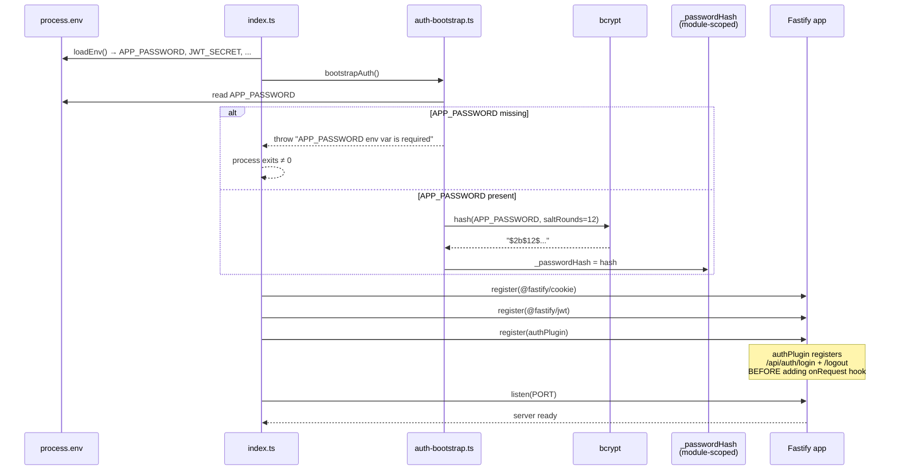
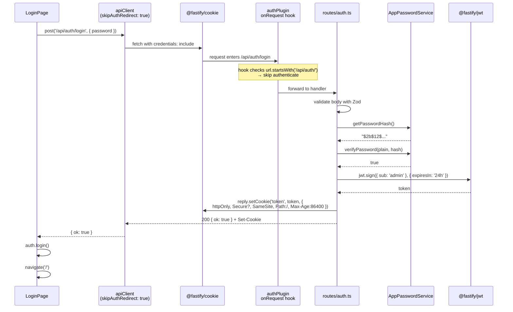

# Design — US-003: JWT Auth (backend + login screen)

> **Change:** `US-003-jwt-auth`
> **Estado:** diseño técnico
> **Última revisión:** 2026-04-27
> **Stack:** Fastify 5 + TS strict + Zod 4 (backend) · React 19 + Vite 6 + Tailwind 4 + react-router-dom@7 (frontend)

---

## Índice

1. [Architecture Overview](#1-architecture-overview)
2. [Backend Architecture](#2-backend-architecture)
3. [Frontend Architecture](#3-frontend-architecture)
4. [Sequence Diagrams](#4-sequence-diagrams)
5. [Architecture Decision Records](#5-adrs)
6. [Tech Debt](#6-tech-debt)

---

## 1. Architecture Overview

US-003 introduce la **única barrera de seguridad** del producto. La idea es chiquita pero tiene varios puntos sensibles: orden de plugins de Fastify, cookie condicional por entorno, y un interceptor de 401 en el frontend que NO debe redirigir cuando el 401 viene del propio endpoint de login. Este diseño congela esos contratos.

### 1.1. Archivos nuevos

#### Backend (`apps/backend/src/`)

| Archivo | Propósito |
|---------|-----------|
| `services/password.ts` | Wrappers de bcrypt: `hashPassword(plain)` y `verifyPassword(plain, hash)`. |
| `services/auth-bootstrap.ts` | Singleton módulo-scoped del hash. Expone `bootstrapAuth()` y `getPasswordHash()`. |
| `plugins/auth.ts` | `FastifyPluginAsync` que decora `fastify.authenticate` y registra el hook `onRequest` para `/api/*`. |
| `routes/auth.ts` | Plugin con `POST /api/auth/login` y `POST /api/auth/logout`. **Públicas** — registradas antes/fuera del hook. |
| `tests/auth/password.test.ts` | Unit. |
| `tests/auth/login.test.ts` | E2E con `fastify.inject()`. |
| `tests/auth/logout.test.ts` | E2E con `fastify.inject()`. |
| `tests/auth/middleware.test.ts` | E2E del hook `onRequest`. |

#### Frontend (`apps/frontend/src/`)

| Archivo | Propósito |
|---------|-----------|
| `lib/auth-context.tsx` | `AuthProvider` + `useAuth()`. Mantiene `isAuthenticated`, expone `login/logout/redirectToLogin`. |
| `lib/api-client.ts` | Wrapper `fetch` con `credentials: 'include'`, interceptor 401 con `skipAuthRedirect`, `UnauthorizedError`. |
| `pages/LoginPage.tsx` | Form de un solo campo + botón "Entrar". Maneja error 401 sin redirigir. |
| `routes/router.tsx` | `createBrowserRouter` con `/login` (público) y `/` (protegido). Incluye `ProtectedRoute`. |
| `pages/DashboardPlaceholder.tsx` | Stub para US-003 — US-004 lo reemplaza. |
| `tests/auth-context.test.tsx` | RTL + `renderHook`. |
| `tests/login-page.test.tsx` | RTL + MSW. |
| `tests/api-client.test.ts` | `vi.spyOn(global, 'fetch')` + tests de interceptor. |
| `tests/protected-route.test.tsx` | Memory router. |

### 1.2. Archivos modificados

| Archivo | Cambio |
|---------|--------|
| `apps/backend/src/index.ts` | Registrar `bootstrapAuth()` antes de plugins; registrar `@fastify/cookie` → `@fastify/jwt` → `authPlugin` → rutas. |
| `apps/backend/package.json` | + `@fastify/cookie@^11`, `@fastify/jwt@^9`, `bcrypt@^5`, `@types/bcrypt`. |
| `apps/frontend/src/App.tsx` | Reemplaza el contenido por `<AuthProvider><RouterProvider router={router} /></AuthProvider>`. |
| `apps/frontend/package.json` | + `react-router-dom@^7`. |

---

## 2. Backend Architecture

### 2.1. AppPasswordService

#### Hashing en startup

`APP_PASSWORD` viene en plano por env var (validado por `env.ts` desde US-001). Al arrancar el proceso:

1. `bootstrapAuth()` lee `process.env.APP_PASSWORD`.
2. Calcula `bcrypt.hash(APP_PASSWORD, 12)` — saltRounds = 12 → ~250 ms una sola vez por proceso.
3. Guarda el resultado en una variable módulo-scoped (`_passwordHash`).
4. La función es **idempotente**: si ya hay hash, no rehashea.

```typescript
// apps/backend/src/services/auth-bootstrap.ts

let _passwordHash: string | null = null

export async function bootstrapAuth(): Promise<void> {
  if (_passwordHash !== null) return // idempotente

  const plain = process.env.APP_PASSWORD
  if (!plain || plain.length === 0) {
    throw new Error('APP_PASSWORD env var is required')
  }

  _passwordHash = await hashPassword(plain)
}

export function getPasswordHash(): string {
  if (_passwordHash === null) {
    throw new Error('Auth not bootstrapped')
  }
  return _passwordHash
}
```

#### Singleton vs DB

El hash NO se persiste en DB ni en disco. Vive sólo en memoria del proceso. Ver ADR-003-01 para el porqué.

#### Tipo público

```typescript
// apps/backend/src/services/password.ts

export async function hashPassword(plain: string): Promise<string>
export async function verifyPassword(plain: string, hash: string): Promise<boolean>
```

`verifyPassword` se apoya en `bcrypt.compare`, que es **tiempo-constante por diseño**. NEGATIVE-01 del spec exige que el endpoint de login NO haga early-exit ante password incorrecto.

### 2.2. Fastify Plugin Registration Order — CRÍTICO

El orden en `apps/backend/src/index.ts` NO es negociable. La secuencia obligatoria:

```typescript
// 1. validar env (US-001) y bootstrapear el hash ANTES de registrar nada
const env = loadEnv()                       // Zod-validated
await bootstrapAuth()                       // hashea APP_PASSWORD una vez

const app = Fastify({ logger: true })

// 2. @fastify/cookie PRIMERO — authPlugin lee request.cookies.token
await app.register(fastifyCookie, { secret: env.COOKIE_SECRET })

// 3. @fastify/jwt SEGUNDO — authPlugin invoca fastify.jwt.verify y .sign
await app.register(fastifyJwt, {
  secret: env.JWT_SECRET,
  cookie: { cookieName: 'token', signed: false },
})

// 4. authPlugin TERCERO — decora fastify.authenticate y agrega onRequest hook
//    DENTRO del plugin se registran /api/auth/login y /api/auth/logout ANTES del hook
await app.register(authPlugin)

// 5. health (público, fuera del hook) y futuras rutas /api/* protegidas
app.get('/health', healthHandler)
```

#### Por qué este orden

| Plugin | Si falta o llega tarde | Síntoma |
|--------|-----------------------|---------|
| `@fastify/cookie` | sin él, `request.cookies` es `undefined` | `authPlugin` lee `undefined.token` → `TypeError` 500 al primer request. |
| `@fastify/jwt` | sin él, `fastify.jwt` no existe | `authPlugin` falla en `app.decorate('authenticate', ...)` o al firmar token en login. |
| `authPlugin` (con orden interno mal) | si el `onRequest` hook se registra ANTES de declarar `/api/auth/login`, esa ruta también queda protegida | bootstrap loop: para loguearse necesitás un token, y para tener token necesitás loguearte. R3 del proposal. |

El orden está fijado en el proposal §3.3 y reforzado acá. El verifier debe marcar como CRITICAL si se altera.

### 2.3. authPlugin design

#### Estructura

```typescript
// apps/backend/src/plugins/auth.ts

import fp from 'fastify-plugin'
import type { FastifyPluginAsync, FastifyRequest, FastifyReply } from 'fastify'
import { authRoutes } from '../routes/auth.js'

const authPlugin: FastifyPluginAsync = async (fastify) => {
  // Decorador disponible para futuras rutas (inspección manual si fuera necesario)
  fastify.decorate('authenticate', async (request: FastifyRequest, reply: FastifyReply) => {
    try {
      await request.jwtVerify({ onlyCookie: true }) // lee cookie 'token'
    } catch {
      return reply.code(401).send({ error: 'Unauthorized' })
    }
  })

  // 1) PRIMERO: registrar las rutas públicas de auth (sin hook)
  await fastify.register(authRoutes, { prefix: '/api/auth' })

  // 2) DESPUÉS: hook que protege todo lo que viene a continuación bajo /api/*
  fastify.addHook('onRequest', async (request, reply) => {
    if (!request.url.startsWith('/api/')) return        // /health y otras rutas no /api/*
    if (request.url.startsWith('/api/auth/')) return    // /api/auth/login y /api/auth/logout
    return fastify.authenticate(request, reply)
  })
}

export default fp(authPlugin, { name: 'authPlugin' })
```

#### Tipo

`FastifyPluginAsync` envuelto con `fastify-plugin` (`fp`) para que el decorador y el hook escapen del encapsulamiento de plugin de Fastify y queden visibles a las rutas registradas DESPUÉS.

#### Rutas públicas vs protegidas — fail-closed

| Ruta | Protección |
|------|-----------|
| `GET /health` | Público (no matchea `/api/`). |
| `POST /api/auth/login` | Público (matchea exclusión `/api/auth/`). |
| `POST /api/auth/logout` | Público (matchea exclusión `/api/auth/`). |
| `* /api/**` (futuras) | **Protegido por defecto** (fail-closed). |

El modelo es **fail-closed**: cualquier ruta nueva bajo `/api/` queda protegida automáticamente, sin que el dev tenga que recordarlo. Esta es la decisión clave del proposal §3.3.

### 2.4. JWT cookie emission

#### Cookie

| Atributo | Valor |
|----------|-------|
| `name` | `token` |
| `httpOnly` | `true` (siempre) |
| `Secure` | `NODE_ENV === 'production'` |
| `SameSite` | `'Strict'` en prod, `'Lax'` en dev/test |
| `Path` | `/` |
| `Max-Age` (login) | `86400` (24 h) |
| `Max-Age` (logout) | `0` |

`Secure` es condicional: ver spec §7.2 y proposal §3.4. Es una desviación intencional documentada (HTTP local en dev).

#### Token payload

```typescript
{
  sub: 'admin',     // literal — single-user, no hay userId
  iat: <unix-ts>,   // emitido automáticamente por @fastify/jwt
  exp: <iat + 86400>
}
```

> **Atención implementadores:** la spec backend §6.1 dice `sub: 'admin'`. NO usar `'cryptofolio-user'` ni ninguna otra variante — el verificador chequea el literal.

Firma: `app.jwt.sign({ sub: 'admin' }, { expiresIn: '24h' })`. Algoritmo HS256 (default de `@fastify/jwt`). Secret leído desde `JWT_SECRET` (≥ 32 chars, validado en `env.ts`).

---

## 3. Frontend Architecture

### 3.1. File structure (new files)

```
apps/frontend/src/
├── App.tsx                          (modified)
├── lib/
│   ├── auth-context.tsx             (new)
│   └── api-client.ts                (new)
├── pages/
│   ├── LoginPage.tsx                (new)
│   └── DashboardPlaceholder.tsx     (new)
└── routes/
    └── router.tsx                   (new — incluye ProtectedRoute)
```

### 3.2. AuthContext

#### Estado

```typescript
interface AuthContextValue {
  isAuthenticated: boolean
  isLoading: boolean         // reservado para GET /api/auth/me futuro
  login: () => void
  logout: () => Promise<void>
  redirectToLogin: () => void
}
```

- `isAuthenticated` arranca en `false`. Se setea a `true` SÓLO después de un login exitoso en la sesión actual.
- `isLoading` arranca en `false`. En US-003 nunca cambia. Queda declarado para que la API no rompa cuando US-006 (o quien sea) agregue `GET /api/auth/me` y necesite mostrar un splash inicial mientras se verifica.

#### Acciones

| Acción | Hace |
|--------|------|
| `login()` | Setea `isAuthenticated = true`. Lo llama `LoginPage` después del 200 del backend. NO toca el backend (eso ya lo hizo `LoginPage`). |
| `logout()` | `POST /api/auth/logout` (con `credentials: 'include'`), setea `isAuthenticated = false`, navega a `/login`. |
| `redirectToLogin()` | Setea `isAuthenticated = false` y navega a `/login`. **NO** llama al backend. Es el path que dispara `apiClient` cuando un endpoint protegido devuelve 401. |

`logout` y `redirectToLogin` son distintos a propósito:

- `logout` es intencional → invalida la cookie en el server.
- `redirectToLogin` es reactivo a un 401 → la cookie ya está rota (expirada o ausente), no tiene sentido golpear el server.

#### Tech-debt explícito (ver §6)

`isAuthenticated` arranca en `false` en cada mount. Si el user recarga, va a `/login` aunque la cookie httpOnly siga siendo válida en el backend. Lo solucionará un futuro `GET /api/auth/me`.

### 3.3. apiClient

#### API

```typescript
// apps/frontend/src/lib/api-client.ts

export class UnauthorizedError extends Error {
  constructor() { super('Unauthorized') }
}

interface ApiOptions extends RequestInit {
  skipAuthRedirect?: boolean  // <-- KEY para evitar el loop en /auth/login
}

export const apiClient = {
  get<T>(url: string, options?: ApiOptions): Promise<T>,
  post<T>(url: string, body: unknown, options?: ApiOptions): Promise<T>,
}
```

#### Comportamiento

1. Base URL: `import.meta.env.VITE_API_URL` (validado por Vite en build). Si no está, default a `''` (same-origin).
2. **Siempre** envía `credentials: 'include'`. Sin esto la cookie httpOnly no viaja → todo da 401.
3. POST/PUT/PATCH: setea `Content-Type: application/json` y `JSON.stringify(body)`.
4. Status 2xx → parsea como JSON y retorna.
5. Status 401 → ver §3.3.1.
6. Otros 4xx/5xx → throw `Error` con `status` y mensaje.
7. Network error (`TypeError`) → throw `Error` (NO `UnauthorizedError`, NO redirect).

#### 3.3.1. Interceptor 401 con `skipAuthRedirect`

**El problema del loop:** el endpoint `POST /api/auth/login` legítimamente devuelve 401 cuando el password está mal. Si el interceptor genérico llamara `redirectToLogin()` ahí, el usuario que ya está en `/login` "navegaría" a `/login` de nuevo, perdiendo el mensaje de error que `LoginPage` quería mostrar (porque el rerender resetea el estado local del form).

**Solución:** `apiClient.post(url, body, { skipAuthRedirect: true })` desactiva el interceptor para esa llamada específica. `LoginPage` la usa así:

```typescript
try {
  await apiClient.post('/api/auth/login', { password }, { skipAuthRedirect: true })
  auth.login()
  navigate('/')
} catch (err) {
  if (err instanceof UnauthorizedError) {
    setError('Password incorrecto')
  } else {
    setError('Error de conexión. Intentá nuevamente.')
  }
}
```

**Detección dentro de apiClient:**

```typescript
async function handleResponse<T>(res: Response, options: ApiOptions): Promise<T> {
  if (res.status === 401) {
    if (!options.skipAuthRedirect) {
      authBridge.redirectToLogin()  // ver §3.3.2 sobre cómo apiClient accede al context
    }
    throw new UnauthorizedError()
  }
  // ...
}
```

**Backup:** si el implementador prefiere, también es válido que `LoginPage` llame `fetch` directo sin pasar por `apiClient` (spec §5.4 lo permite). El diseño preferido es `skipAuthRedirect` porque mantiene UNA única ruta de red en la app.

#### 3.3.2. Cómo `apiClient` accede a `redirectToLogin` sin acoplarse a React

`apiClient` es un módulo plano (no un hook). No puede llamar `useAuth()`. Para puentear se usa un módulo `auth-bridge` que `AuthProvider` setea en su `useEffect` inicial:

```typescript
// apps/frontend/src/lib/api-client.ts (interno)
let _redirectToLogin: () => void = () => {
  // fallback: full-page nav si nadie registró handler todavía
  window.location.assign('/login')
}

export function registerAuthBridge(redirect: () => void) {
  _redirectToLogin = redirect
}

// AuthProvider hace registerAuthBridge(redirectToLogin) en useEffect
```

Esta indirección permite testear `apiClient` sin renderizar React, y permite que `AuthProvider` use `useNavigate` (que sí necesita el contexto del router).

### 3.4. react-router-dom@7 route structure

```
<App>
  <AuthProvider>                          // estado de auth + bridge a apiClient
    <RouterProvider router={router}>
      ├── /login   → <LoginPage />        // público
      └── /        → <ProtectedRoute>     // gate basado en isAuthenticated
                       <DashboardPlaceholder />
                     </ProtectedRoute>
```

`router.tsx`:

```typescript
import { createBrowserRouter, Navigate } from 'react-router-dom'

function ProtectedRoute({ children }: { children: React.ReactNode }) {
  const { isAuthenticated } = useAuth()
  if (!isAuthenticated) return <Navigate to="/login" replace />
  return <>{children}</>
}

export const router = createBrowserRouter([
  { path: '/login', element: <LoginPage /> },
  {
    path: '/',
    element: (
      <ProtectedRoute>
        <DashboardPlaceholder />
      </ProtectedRoute>
    ),
  },
])
```

**Atención:** `AuthProvider` DEBE envolver `RouterProvider` (no al revés). `redirectToLogin` usa `useNavigate` internamente, y `useNavigate` necesita estar dentro del Router. La forma de resolverlo es: `AuthProvider` recibe los children y dentro montamos un componente `AuthBridge` que SÍ está dentro del Router y que llama `registerAuthBridge(navigate-based redirect)`. Ver `auth-context.tsx` para el patrón final.

### 3.5. LoginPage

#### Layout (Tailwind 4)

- Container centrado vertical+horizontal (`grid place-items-center min-h-dvh`).
- Card con `max-w-sm`, padding generoso, bordes suaves.
- `<form>` con un único `<input type="password">` + `<button type="submit">Entrar</button>`.
- `<p role="alert">` para el error, oculto si `!error`.

#### Estado local

```typescript
const [password, setPassword] = useState('')
const [error, setError] = useState<string | null>(null)
const [submitting, setSubmitting] = useState(false)
```

#### Submit

1. `e.preventDefault()`.
2. Validación local: si `password.trim() === ''` → setError("Ingresá tu password") y abort. **NO** se hace fetch.
3. `setSubmitting(true)`, `setError(null)`.
4. `try { await apiClient.post('/api/auth/login', { password }, { skipAuthRedirect: true }); auth.login(); navigate('/'); } catch ...` (ver §3.3.1).
5. `finally { setSubmitting(false) }`.

#### Errores y mensajes (spec §8.1)

| Caso | Mensaje |
|------|---------|
| 401 | `"Password incorrecto"` |
| Campo vacío | `"Ingresá tu password"` |
| Network error | `"Error de conexión. Intentá nuevamente."` |
| 5xx u otro | `"Ocurrió un error. Intentá nuevamente."` |

#### Accesibilidad (spec §8.2)

- `<label htmlFor="password">Password</label>` asociado al input.
- `<p role="alert">` para el error.
- Botón con `aria-disabled={submitting}` cuando está cargando.

---

## 4. Sequence Diagrams

### 4.1. Diagram 1 — Backend startup flow



### 4.2. Diagram 2 — Login flow (happy path)



### 4.3. Diagram 3 — Authenticated request + 401 auto-redirect

```mermaid
sequenceDiagram
    participant FE as Component<br/>(authenticated screen)
    participant API as apiClient
    participant Bridge as authBridge
    participant Cookie as @fastify/cookie
    participant Auth as authPlugin<br/>onRequest hook
    participant JWT as @fastify/jwt
    participant Router as react-router-dom

    FE->>API: get('/api/portfolio')
    API->>Cookie: fetch + credentials: include<br/>(cookie 'token' atada por browser)
    Cookie->>Auth: request enters /api/portfolio
    Note over Auth: url.startsWith('/api/') &&<br/>!url.startsWith('/api/auth/')<br/>→ run authenticate
    Auth->>JWT: request.jwtVerify({ onlyCookie: true })
    JWT-->>Auth: throw (TokenExpiredError)
    Auth-->>API: 401 { error: 'Unauthorized' }
    API->>API: skipAuthRedirect? false
    API->>Bridge: _redirectToLogin()
    Bridge->>Router: navigate('/login')
    Bridge->>Bridge: setIsAuthenticated(false)
    API-->>FE: throw UnauthorizedError
    Note over FE: component unmounts mid-render;<br/>user lands on /login
```

---

## 5. ADRs

### ADR-003-01 — Hash en memoria del proceso, no persistido en DB

**Contexto.** El producto es single-user. `APP_PASSWORD` viene de `.env` y no cambia entre arranques (salvo rotación manual). Tenemos dos opciones para el hash bcrypt:

1. **En memoria** (módulo-scoped singleton, recalculado en cada arranque).
2. **En DB** (tabla `app_config(key, value)`, calculado una vez y persistido).

**Decisión.** Opción 1 — en memoria.

**Razones:**

- US-002 no creó tabla `app_config`. Crearla acá implica una migración nueva sólo para guardar UN string.
- bcrypt factor 12 tarda ~250 ms una sola vez por arranque. En Render free tier el cold-start ya es ~5 s; 250 ms son ruido.
- Si `APP_PASSWORD` cambia en `.env`, queremos que el nuevo hash valga inmediatamente al reiniciar — el modelo en-memoria lo logra trivialmente. El modelo DB requeriría un fingerprint para detectar cambios.
- No hay multi-instancia: Render free tier corre UN proceso. Si en el futuro escalamos horizontal, cada instancia rehashea por su cuenta (idempotente).

**Consecuencias.**

- Cada deploy/restart tiene un costo de ~250 ms en startup. Aceptable.
- Para rotar password sin reiniciar haría falta una nueva story (aún no hay caso de uso).
- Si en algún momento queremos múltiples credentials (ej. Service Tokens para CI), va a haber que migrar a DB. Será deuda asumida.

### ADR-003-02 — `@fastify/jwt` en lugar de `jsonwebtoken` directo

**Contexto.** Necesitamos firmar y verificar HS256 24h. Las opciones:

1. **`@fastify/jwt`** — plugin oficial, decora `fastify.jwt.sign/verify` y `request.jwtVerify`.
2. **`jsonwebtoken`** — la lib pelada, más control manual.

**Decisión.** `@fastify/jwt`.

**Razones:**

- Integra con el lifecycle de Fastify: `request.jwtVerify({ onlyCookie: true })` lee la cookie sin que tengamos que parsear `request.cookies.token` a mano.
- Tipa el `request.user` automáticamente, útil cuando US-004+ quiera leer `sub` del token.
- Ya viene con `cookie: { cookieName: 'token' }` como opción de configuración → menos boilerplate.
- Interno usa `jsonwebtoken`, así que no estamos sacrificando nada.

**Consecuencias.**

- Acoplamiento a Fastify (no portable a Express). No es problema: el stack está fijado.
- Una dependencia más en `package.json`. Aceptable.

### ADR-003-03 — `react-router-dom@7`

**Contexto.** US-003 introduce dos rutas (`/login` y `/`). US-004+ va a sumar `/wallets`, `/token/:address/:network`, `/transactions/new`, etc. Opciones:

1. **`react-router-dom@7`** — standard del ecosistema React.
2. **TanStack Router** — type-safe, file-based, más reciente.
3. **Wouter** — minimalista, ~2 KB.
4. **Ruteo manual con `useState`** — como el prototipo en `prototipo/`.

**Decisión.** `react-router-dom@7`.

**Razones:**

- Compatibilidad confirmada con React 19.
- API estable, conocida por la mayoría. Onboarding de cualquier collaborator es cero.
- `<Navigate>`, `useNavigate`, `createBrowserRouter` cubren los casos de US-003 y todas las stories siguientes.
- TanStack es excelente pero impone fileconventions que chocan con la estructura actual (`pages/`, `routes/`).
- Wouter es chico pero no resuelve nested routes futuras (`/token/:address/:network`).
- Ruteo manual no escala: el prototipo lo hace porque es prototipo.

**Consecuencias.**

- Bundle: ~12 KB gzip. Aceptable.
- API "new mode" (`createBrowserRouter`) en lugar del legacy `<BrowserRouter>` — es la dirección oficial recomendada en v7.

### ADR-003-04 — Patrón `skipAuthRedirect` en `apiClient`

**Contexto.** El interceptor de 401 en `apiClient` redirige automáticamente a `/login` cuando un endpoint protegido falla. Pero el endpoint `/api/auth/login` legítimamente devuelve 401 cuando el password está mal. Sin un escape, se produciría un loop:

1. User submit con password incorrecto.
2. Backend → 401.
3. `apiClient` interceptor → `redirectToLogin()` → `navigate('/login')`.
4. `LoginPage` rerenderiza (ya estaba en `/login` pero el nav resetea su estado local).
5. El error `"Password incorrecto"` que `LoginPage` setteó se pierde antes de pintarse.

**Opciones:**

1. **`skipAuthRedirect: true`** como opción de `apiClient.post`.
2. **Lista negra de URLs** en `apiClient` (`if (url.includes('/auth/login')) skip`).
3. **`LoginPage` usa `fetch` directo**, fuera de `apiClient`.

**Decisión.** Opción 1 — `skipAuthRedirect: true`.

**Razones:**

- Explícito en el call-site: el lector de `LoginPage` ve por qué se opt-out.
- Generalizable: si en el futuro hay otro endpoint con 401 legítimo (ej. `POST /api/auth/refresh` cuando exista), reusa el mismo patrón.
- La opción 2 esconde la lógica en `apiClient` y se rompe silenciosamente si el path cambia.
- La opción 3 fragmenta la red en dos caminos (`fetch` y `apiClient`) → el verifier puede confundirse y el devEx empeora.

**Consecuencias.**

- `apiClient.post` tiene una opción más en su firma. Documentada.
- Hay que recordar pasarla en `LoginPage`. El test `SC-API-05` lo cubre.

---

## 6. Tech Debt

### TD-1 — `GET /api/auth/me` no existe → la sesión no persiste tras reload

**Síntoma.** `isAuthenticated` arranca en `false` en cada mount de `AuthProvider`. Si el usuario hace F5, `ProtectedRoute` lo manda a `/login` aunque la cookie httpOnly siga siendo válida en el backend.

**Por qué se acepta en US-003.** Resolverlo bien implica:
- Endpoint backend `GET /api/auth/me` que devuelva `{ ok: true }` si la cookie es válida.
- Splash/loading state en `AuthProvider` mientras se hace la verificación inicial.
- `isLoading` real (hoy declarado pero no usado) — `LoginPage` y `ProtectedRoute` necesitan reaccionar al loading.

Es una pieza chica pero con su propio set de tests y escenarios. La spec del backend §3 NO lo incluye, y la del frontend §2.3 explícitamente lo declara fuera de scope.

**Plan.** Levantar story `US-003.1-session-persistence` después de US-004 — cuando ya tengamos al menos una API real para probar la persistencia end-to-end.

### TD-2 — Sin rate limiting en `/api/auth/login`

**Síntoma.** El endpoint acepta requests ilimitadas. Un atacante con acceso a la URL pública puede intentar fuerza bruta.

**Por qué se acepta en US-003.**
- Es single-user → el password lo eligió el dueño y se asume entropía razonable (≥ 12 chars con mezcla).
- bcrypt factor 12 da ~250 ms por intento → ~14k intentos/hora por proceso. Para `Password123` cae en minutos; para `correct horse battery staple` levanta meses.
- El alcance público de la API es chico (un dominio Render no listado).
- Agregar rate limit ahora implica decidir: in-memory (no escala) vs Redis (no está en el stack) vs middleware token-bucket por IP (cuál IP cuando hay proxies de Render).

**Plan.** Story `US-Hardening-rate-limit` post-MVP. Probable solución: `@fastify/rate-limit` con in-memory limit de 5 intentos / 60 s por IP.

---

## Notas para implementadores

Tres cosas que el verifier va a chequear con lupa y que es fácil meter mal:

1. **Orden de plugins en `index.ts`** (§2.2). El test E2E `middleware.test.ts` rompe si está mal — pero el síntoma (TypeError sobre `request.cookies`) es engañoso. Si ves eso, revisá el orden.
2. **Sub claim del JWT es literal `'admin'`** (spec backend §6.1 + §SC-LOGIN-01). NO `'cryptofolio-user'`. NO `'user'`.
3. **`AuthProvider` envuelve `RouterProvider`, NO al revés** (§3.4). Si invertís el orden, `useNavigate` desde dentro de `AuthProvider` tira "useNavigate must be used within a Router".
