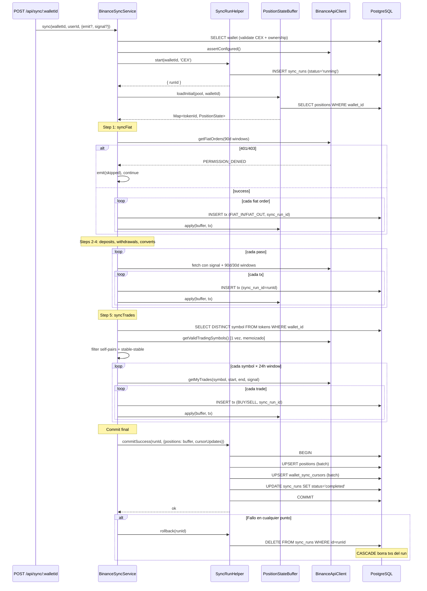

# Diseño — US-014: Binance sync con historia completa, fiat y cobertura de pares ampliada

> Cambio: `us-014-binance-complete-sync`
> Generado: 2026-05-10

---

## Enfoque técnico

US-014 modifica `BinanceSyncService` y `BinanceApiClient` sin agregar migraciones SQL. El schema ya está preparado (US-013: `FIAT_IN`/`FIAT_OUT` + `cex_order_id`; US-018: `sync_runs` + `sync_run_id`). La US refactoriza el flujo de sync CEX para:

1. Arrancar desde 2017-01-01 en vez de 2025-12-01
2. Agregar `syncFiat()` como primer paso
3. Ampliar cobertura de pares a 6 quote assets
4. Descubrir assets desde DB (no balance)
5. Integrar con `SyncRunHelper` para atomicidad

**Quick path**: El cambio más riesgoso es la integración con `SyncRunHelper`, que cambia el patrón de persistencia de `persistBinanceTx` (escribe position inline en cada tx) a escritura diferida (positions en memoria, commit al final). Esto requiere refactorizar `persistBinanceTx` para que ya NO haga UPSERT de positions directamente.

---

## Decisiones de arquitectura

| # | Decisión | Alternativa descartada | Razón |
|---|----------|----------------------|-------|
| D1 | Refactorizar `persistBinanceTx` para NO hacer UPSERT de position inline. Delegarlo al `PositionStateBuffer.apply()` en memoria. | Mantener el UPSERT inline y duplicar en commit final | El UPSERT inline rompe la atomicidad: si el run falla, las positions ya estarían escritas. |
| D2 | `persistBinanceTx` pasa a hacer sólo INSERT de la transacción (con `sync_run_id`). El position engine se invoca vía `PositionStateBuffer.apply()` después de cada INSERT exitoso. | Acumular todas las txs en memoria y hacer un batch INSERT final | Los batch INSERT finales duplicarían el uso de memoria en wallets grandes. INSERT individual + `ON CONFLICT DO NOTHING` es idempotente y permite acumular `txs_persisted` incrementalmente. |
| D3 | `syncFiat()` usa mismo patrón de cursor con ventanas de 90 días, idéntico a deposits/withdrawals | Fetch de toda la historia en un solo request | Binance pagina por ventana temporal, no por page number. Las ventanas de 90d ya están probadas en deposits/withdrawals. |
| D4 | El `signed()` helper de `binance-api.ts` recibe `signal?: AbortSignal` y lo propaga a `fetch()` | Agregar signal solo a métodos nuevos | Propagación end-to-end es requisito de US-015; hacerlo parcial generaría inconsistencias y memory leaks en aborts. |
| D5 | `discoverAssets()` pierde la llamada a `getAccountAssets()` y consulta SOLO la DB | Mantener ambas fuentes | `getAccountAssets()` solo ve balance > 0 actual; no ve assets históricos. La DB tiene todos los tokens creados por pasos previos del run. |
| D6 | `discoverAssets()` filtra por `wallet_id` (no global) | `WHERE network = 'CEX_BINANCE'` sin filtro de wallet | Multi-wallet futuro: un usuario podría tener 2 API keys. Filtrar por wallet mantiene el invariante. |
| D7 | Fiat price service como método nuevo en `PriceService` existente | Módulo separado `fiat-price-service.ts` | `PriceService` ya es el punto central de precios. Agregar `getFiatToUsdAt()` mantiene cohesión. |

---

## Arquitectura resultante

### Flujo de sync CEX refactorizado

```
POST /api/sync/:walletId  (o GET stream en US-015)
  │
  └─→ BinanceSyncService.sync(walletId, userId, { emit?, signal? })
        │
        ├── 1. Validate wallet (CEX, belongs to user)
        ├── 2. binanceClient.assertConfigured()
        ├── 3. syncRunHelper.start(walletId, 'CEX') → runId
        ├── 4. positionStateBuffer.loadInitial(pool, walletId) → buffer
        │
        ├── 5. syncFiat(walletId, runId, buffer, { emit, signal })
        │     ├── getFiatOrders()  — ventanas 90d, cursor 'fiat:orders'
        │     └── getFiatPayments() — ventanas 90d, cursor 'fiat:payments'
        │     → type=0 → FIAT_IN ; type=1 → FIAT_OUT
        │     → 401/403 → skipped/PERMISSION_DENIED, continue
        │
        ├── 6. syncDeposits(walletId, runId, buffer, { emit, signal })
        ├── 7. syncWithdrawals(walletId, runId, buffer, { emit, signal })
        ├── 8. syncConvert(walletId, runId, buffer, { emit, signal })
        │
        ├── 9. syncTrades(walletId, runId, buffer, { emit, signal })
        │     ├── discoverAssets(walletId) ← SELECT DISTINCT symbol WHERE wallet_id=$1
        │     ├── getValidTradingSymbols() ← 1 sola vez, memoizado
        │     ├── filter self-pairs + stable-stable
        │     └── loop 24h windows por symbol
        │
        ├── 10. Collect cursorUpdates from in-memory accumulator
        └── 11. syncRunHelper.commitSuccess(runId, { positions: buffer, cursorUpdates })
              └── FALLO en cualquier punto → syncRunHelper.rollback(runId) en finally
```

### Diagrama de secuencia — sync CEX con fiat y atomicidad



---

## Diseño por componente

### 1. `binance-api.ts` — Cambios en el client

**Cambio 1: `signal` en `signed()`**

El helper interno `signed<T>()` pasa a aceptar `signal?: AbortSignal`:

```typescript
async function signed<T>(
  endpoint: string,
  params: Record<string, string | number> = {},
  silentCodes: number[] = [],
  signal?: AbortSignal,
): Promise<T> {
  // ...existing...
  res = await fetch(`${BINANCE_BASE}${endpoint}?${qs.toString()}`, {
    headers: { 'X-MBX-APIKEY': apiKey },
    signal,  // ← propagado
  });
  // ...
}
```

Todos los métodos de la interfaz `BinanceApiClient` agregan `signal?: AbortSignal` al final de su firma. `getValidTradingSymbols()` (público, sin firma) también lo propaga.

**Cambio 2: Nuevos tipos + métodos fiat**

```typescript
export type BinanceFiatOrder = {
  orderNo: string;        // UUID format
  sourceAmount: string;
  obtainAmount: string;
  fiatCurrency: string;
  cryptoCurrency: string;
  totalFee: string;
  price: string;          // USD/asset para orders
  status: string;         // 'Completed' | 'Failed' | ...
  createTime: number;     // unix ms
};

export type BinanceFiatPayment = {
  orderNo: string;        // UUID format
  sourceAmount: string;
  obtainAmount: string;
  fiatCurrency: string;
  cryptoCurrency: string;
  totalFee: string;
  status: string;
  createTime: number;     // unix ms
};
```

Interfaz ampliada:
```typescript
export interface BinanceApiClient {
  // ...existing...
  getFiatOrders(opts: { beginTime: number; endTime: number; transactionType: 0 | 1; signal?: AbortSignal }): Promise<BinanceFiatOrder[]>;
  getFiatPayments(opts: { beginTime: number; endTime: number; transactionType: 0 | 1; signal?: AbortSignal }): Promise<BinanceFiatPayment[]>;
}
```

**Cambio 3: Detección de PERMISSION_DENIED en fiat**

Los métodos fiat llaman a `signed()` pasando códigos de permisos como `silentCodes` NO — en vez de eso, detectan el error y lo re-lanzan como un tipo específico para que `syncFiat()` lo distinga:

```typescript
// Error distinguible para permisos fiat
export class FiatPermissionDeniedError extends Error {
  constructor(endpoint: string, code?: number) {
    super(`Fiat endpoint ${endpoint} denied: code=${code}`);
    this.name = 'FiatPermissionDeniedError';
  }
}
```

En `getFiatOrders()` / `getFiatPayments()`: si `res.status` es 401/403, o `body.code` ∈ `{-1022, -2008, -2014, -2015, -1109}`, lanza `FiatPermissionDeniedError` en vez del genérico `ExternalApiError`.

---

### 2. `binance-sync.ts` — Cambios en el service

**Cambio 1: Constante + exports**

```typescript
// Reemplaza SYNC_START_MS
export const BINANCE_HISTORY_FLOOR_MS = new Date('2017-01-01T00:00:00.000Z').getTime();
export const QUOTE_ASSETS = ['USDT', 'USDC', 'BTC', 'ETH', 'BNB', 'FDUSD'] as const;

// Stables ampliados para filtro de self-pairs
const STABLE_ASSETS = new Set(['USDT', 'USDC', 'BUSD', 'USD', 'FDUSD', 'TUSD', 'DAI']);

function isStablePair(base: string, quote: string): boolean {
  return STABLE_ASSETS.has(base.toUpperCase()) && STABLE_ASSETS.has(quote.toUpperCase());
}
```

**Cambio 2: `getQuoteAsset()` actualizado**

```typescript
function getQuoteAsset(symbol: string): string {
  // Longest suffixes first: FDUSD (5 chars), then 4-char, then 3-char
  for (const suffix of ['FDUSD', 'USDT', 'USDC', 'BUSD', 'BNB', 'BTC', 'ETH']) {
    if (symbol.endsWith(suffix)) return suffix;
  }
  return symbol.slice(-3);
}
```

**Cambio 3: Firma de `sync()` y flujo principal**

```typescript
// Tipo emitter compatible con US-015
export type SyncEmitter = (event: Record<string, unknown>) => void;

async sync(
  walletId: string,
  userId: string,
  opts?: { emit?: SyncEmitter; signal?: AbortSignal },
): Promise<BinanceSyncResult> {
  const emit = opts?.emit ?? (() => {});
  const signal = opts?.signal;

  // ... validate wallet, assertConfigured ...

  const syncRunHelper = new SyncRunHelper(this.deps.pool);
  const { runId } = await syncRunHelper.start(walletId, 'CEX');
  const buffer = await loadInitial(this.deps.pool, walletId);
  const cursorUpdates: Array<{ operation: string; value: string }> = [];

  try {
    // Accumulator for cursor updates (deferred)
    const deferCursor = (op: string, valueMs: number) => {
      cursorUpdates.push({ operation: op, value: `${new Date(valueMs).toISOString()}` });
    };

    const fiatResult = await this.syncFiat(walletId, runId, buffer, deferCursor, { emit, signal });
    this.checkAborted(signal);

    const depositsResult = await this.syncDeposits(walletId, runId, buffer, deferCursor, { emit, signal });
    this.checkAborted(signal);

    const withdrawalsResult = await this.syncWithdrawals(walletId, runId, buffer, deferCursor, { emit, signal });
    this.checkAborted(signal);

    const convertsResult = await this.syncConvert(walletId, runId, buffer, deferCursor, { emit, signal });
    this.checkAborted(signal);

    const tradesResult = await this.syncTrades(walletId, runId, buffer, deferCursor, { emit, signal });

    // Commit final atómico
    await syncRunHelper.commitSuccess(runId, { positions: buffer, cursorUpdates });

    return { trades: tradesResult, converts: convertsResult, withdrawals: withdrawalsResult,
             deposits: depositsResult, fiat: fiatResult, tokensCreated: 0 };
  } catch (err) {
    await syncRunHelper.rollback(runId).catch(() => {});
    throw err;
  }
}

private checkAborted(signal?: AbortSignal): void {
  if (signal?.aborted) throw new Error('ABORTED');
}
```

**Cambio 4: `persistBinanceTx` refactorizado**

El método actual hace: INSERT tx → SELECT position → processTransaction → UPSERT position (inline).

El nuevo modelo:
1. INSERT tx (con `sync_run_id = runId`, SIN upsert de position)
2. `PositionStateBuffer.apply(buffer, tx)` en el caller

```typescript
private async persistBinanceTxAtomic(
  pgc: PoolClient,
  opts: PersistBinanceTxOpts & { syncRunId: string },
): Promise<{ inserted: boolean; id: string }> {
  const txId = opts.id ?? crypto.randomUUID();

  const result = await pgc.query(
    `INSERT INTO transactions (
      id, wallet_id, token_id, type, source, cex_trade_id, cex_order_id,
      tx_log_index, related_tx_id, tx_hash, amount, price_usd, cost_source,
      from_address, to_address, commission_asset, commission_amount,
      cex_timestamp, sync_run_id
    ) VALUES ($1,$2,$3,$4,'BINANCE',$5,$6,$7,$8,$9,$10,$11,$12,$13,$14,$15,$16,$17,$18)
    ON CONFLICT DO NOTHING`,
    [txId, opts.walletId, opts.tokenId, opts.type, opts.cexTradeId, opts.cexOrderId ?? null,
     opts.txLogIndex, opts.relatedTxId ?? null, opts.txHash ?? null,
     opts.amount, opts.priceUsd, opts.costSource,
     opts.fromAddress ?? null, opts.toAddress ?? null,
     opts.commissionAsset ?? null, opts.commissionAmount ?? null,
     opts.cexTimestamp, opts.syncRunId],
  );

  const inserted = (result.rowCount ?? 0) > 0;
  return { inserted, id: txId };
}
```

**Cambio 5: `syncFiat()` nuevo**

```typescript
private async syncFiat(
  walletId: string,
  runId: string,
  buffer: Map<string, PositionState>,
  deferCursor: (op: string, ms: number) => void,
  opts: { emit?: SyncEmitter; signal?: AbortSignal },
): Promise<number> {
  const { emit = () => {}, signal } = opts;
  emit({ step: 'fiat', status: 'running' });

  const pgc = await this.deps.pool.connect();
  try {
    let total = 0;

    // Process fiat orders (card purchases/sells)
    try {
      total += await this.syncFiatEndpoint(pgc, walletId, runId, buffer, deferCursor, {
        endpoint: 'orders',
        cursorOp: 'fiat:orders',
        fetchFn: (begin, end, type, sig) => this.deps.binanceClient.getFiatOrders({ beginTime: begin, endTime: end, transactionType: type, signal: sig }),
        signal,
      });
    } catch (err) {
      if (err instanceof FiatPermissionDeniedError) {
        emit({ step: 'fiat', status: 'skipped', code: 'PERMISSION_DENIED', message: '...' });
        return 0;
      }
      throw err;
    }

    // Process fiat payments (bank transfers)
    try {
      total += await this.syncFiatEndpoint(pgc, walletId, runId, buffer, deferCursor, {
        endpoint: 'payments',
        cursorOp: 'fiat:payments',
        fetchFn: /* similar */,
        signal,
      });
    } catch (err) {
      if (err instanceof FiatPermissionDeniedError) {
        // orders already synced, only payments denied
        emit({ step: 'fiat', status: 'done', synced: total, message: 'payments skipped (permissions)' });
        return total;
      }
      throw err;
    }

    emit({ step: 'fiat', status: 'done', synced: total });
    return total;
  } finally {
    pgc.release();
  }
}
```

**Cambio 6: `discoverAssets()` simplificado**

```typescript
private async discoverAssets(pgc: PoolClient, walletId: string): Promise<string[]> {
  // tokens no tiene wallet_id — join a transactions para filtrar por wallet
  const result = await pgc.query<{ symbol: string }>(
    `SELECT DISTINCT t.symbol
     FROM tokens t
     JOIN transactions tx ON tx.token_id = t.id
     WHERE tx.wallet_id = $1 AND t.network = 'CEX_BINANCE'`,
    [walletId],
  );
  return result.rows.map(r => r.symbol.toUpperCase()).filter(s => !isStable(s));
}
```

**Nota**: `tokens` no tiene `wallet_id` (es global por network+symbol). El join a `transactions` filtra por wallet del usuario (D6). Los tokens insertados por `syncFiat()`/`syncDeposits()`/etc. dentro del mismo run ya están en DB porque `persistBinanceTxAtomic` hace INSERT directo (con `sync_run_id`). No están en `positions` todavía (escritura diferida), pero sí están en `tokens` y `transactions`.

**Cambio 7: `syncTrades()` — memoización + filtro self-pairs**

```typescript
private async syncTrades(
  walletId: string,
  runId: string,
  buffer: Map<string, PositionState>,
  deferCursor: (op: string, ms: number) => void,
  opts: { emit?: SyncEmitter; signal?: AbortSignal },
): Promise<number> {
  const pgc = await this.deps.pool.connect();
  try {
    const [assets, validSymbols] = await Promise.all([
      this.discoverAssets(pgc, walletId),
      this.deps.binanceClient.getValidTradingSymbols(opts.signal),  // memoizado: 1 sola llamada
    ]);

    // Build candidate pairs, filtering self-pairs and stable-stable
    const candidates: string[] = [];
    for (const asset of assets) {
      for (const quote of QUOTE_ASSETS) {
        if (asset === quote) continue;
        if (isStablePair(asset, quote)) continue;
        const symbol = `${asset}${quote}`;
        if (validSymbols.has(symbol)) candidates.push(symbol);
      }
    }

    // ... loop por symbol + 24h windows, usando BINANCE_HISTORY_FLOOR_MS ...
  } finally {
    pgc.release();
  }
}
```

---

### 3. `price.ts` — Nuevo método `getFiatToUsdAt()`

```typescript
async getFiatToUsdAt(fiatCurrency: string, timestampMs: number): Promise<string | null> {
  // Para USD, rate = 1
  if (fiatCurrency.toUpperCase() === 'USD') return '1';

  // Binance public endpoint: ticker price para fiat→USDT pair
  // Fallback: return null → caller persiste con cost_source='MANUAL'
  try {
    const symbol = `${fiatCurrency.toUpperCase()}USDT`;
    const res = await fetch(`https://api.binance.com/api/v3/ticker/price?symbol=${symbol}`);
    if (!res.ok) return null;
    const data = await res.json() as { price: string };
    return data.price;
  } catch {
    return null;
  }
}
```

---

## Archivos afectados

| Archivo | Acción | Descripción |
|---------|--------|-------------|
| `apps/backend/src/sync/clients/binance-api.ts` | MODIFICAR | Agregar `signal` a `signed()` y todos los métodos; agregar tipos + métodos fiat; error `FiatPermissionDeniedError` |
| `apps/backend/src/services/binance-sync.ts` | MODIFICAR | Constantes, orden, `syncFiat()`, `discoverAssets()`, `getQuoteAsset()`, refactorizar `persistBinanceTx`, integrar `SyncRunHelper` |
| `apps/backend/src/services/price.ts` | MODIFICAR | Agregar `getFiatToUsdAt()` |
| `apps/backend/src/schemas/sync.ts` | MODIFICAR | Agregar `fiat` al `BinanceSyncResultSchema` |
| `apps/backend/tests/sync-binance-fiat.test.ts` | CREAR | Tests para `syncFiat()`, permisos, cursores |
| `apps/backend/tests/sync-binance-complete.test.ts` | CREAR | Tests de integración: flujo completo con atomicidad |
| `apps/backend/src/services/binance-sync.test.ts` | MODIFICAR | Adaptar tests existentes al nuevo flujo |

**Sin cambios** (por diseño):
- `apps/backend/src/position-engine/*` — ya soporta FIAT_IN/FIAT_OUT (US-013)
- `apps/backend/src/services/sync-run-helper.ts` — se usa as-is (US-018)
- `apps/backend/src/services/position-state-buffer.ts` — se usa as-is (US-018)
- `db/migrations/*` — sin migraciones nuevas
- `db/enums.ts` — ya tiene FIAT_IN/FIAT_OUT (US-013)
- Frontend — fuera de scope

---

## Riesgos y mitigaciones

| Riesgo | Impacto | Mitigación |
|--------|---------|------------|
| Refactorizar `persistBinanceTx` para no escribir positions inline puede romper tests existentes | Alto | Adaptar test fixtures existentes; los tests de engine no cambian |
| `discoverAssets()` sin `getAccountAssets()` podría perder assets que solo tienen balance pero nunca tuvieron txs | Bajo | En la práctica imposible: Binance no te da balance sin al menos un deposit/trade. Documentar como edge case conocido. |
| `ensureTokenCex()` ya no tiene wallet_id, pero `discoverAssets()` filtra por wallet_id | Bajo | `ensureTokenCex()` crea tokens sin wallet_id (tabla `tokens` no tiene FK a wallets). La query de discover busca por `tokens.wallet_id` — **REVISAR**: la tabla `tokens` probablemente no tiene `wallet_id`. El filtro real es en `transactions.wallet_id`. Ajustar query. |
| Rate-limit en Binance por 8 años de historia | Medio | Cursores incrementales + ventanas ya implementadas. Primera sync será larga pero solo una vez. |

---

## Review checklist

- [ ] `SYNC_START_MS` no existe en ningún archivo del repo
- [ ] `BINANCE_HISTORY_FLOOR_MS` exportado y usado en todos los cursores
- [ ] `getQuoteAsset('ETHFDUSD')` retorna `'FDUSD'`
- [ ] `getQuoteAsset('BTCUSDC')` retorna `'USDC'`
- [ ] `USDTUSDC`, `USDCFDUSD` no están en candidatos de trades
- [ ] `discoverAssets()` no llama a `getAccountAssets()`
- [ ] `getValidTradingSymbols()` se llama exactamente 1 vez por run
- [ ] `AbortSignal` propagado a `fetch()` en `signed()`
- [ ] Todos los INSERT de tx llevan `sync_run_id = runId`
- [ ] `positions` UPSERT solo ocurre en `commitSuccess()`, no inline
- [ ] `wallet_sync_cursors` solo se actualiza en `commitSuccess()`
- [ ] 403 en fiat → `skipped`, no abort
- [ ] 500 en fiat → error real, abort + rollback
- [ ] `BinanceSyncResult` incluye campo `fiat`
- [ ] `npm run typecheck` pasa
- [ ] `npm run test:sync` pasa
- [ ] `npm run test:engine` pasa sin regresiones
