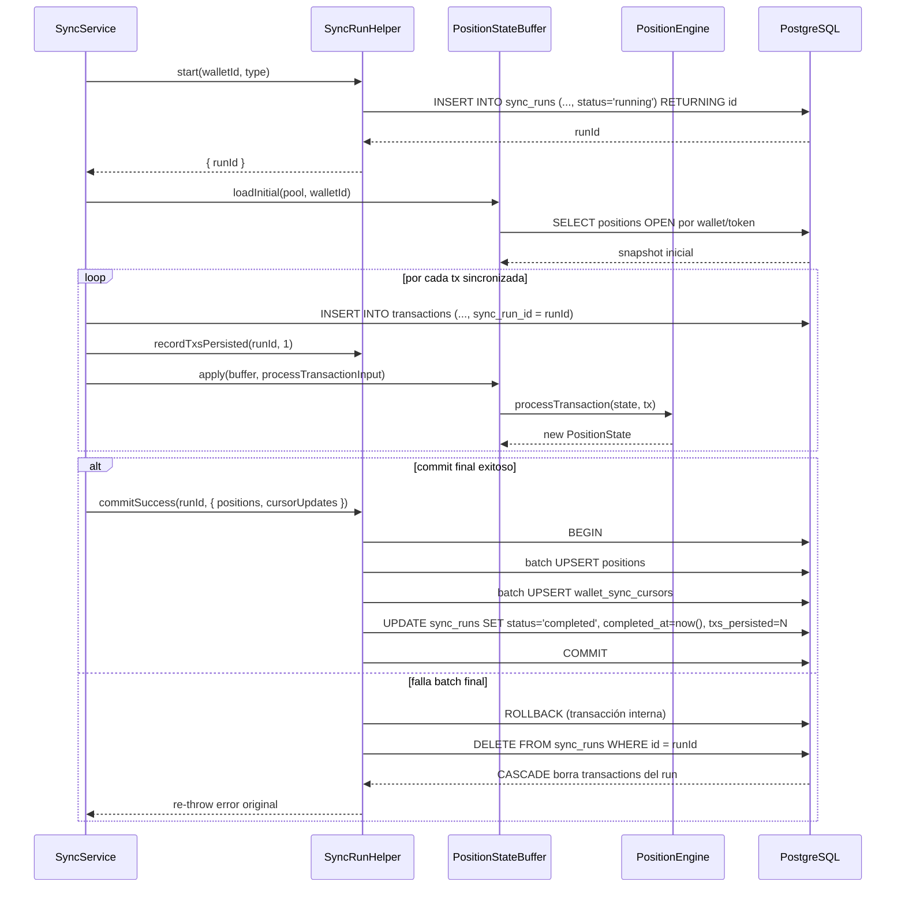

# Design: US-018 — atomicidad por run con `sync_runs` + CASCADE rollback + escritura diferida de `positions`

## Enfoque Técnico

La decisión central es simple: una sync sólo se considera exitosa cuando **transacciones, positions y cursores** quedan consistentes al final del run. Para lograrlo, US-018 separa dos momentos: durante la sync se persisten únicamente las transacciones hijas marcadas con `sync_run_id`; recién al final se escribe el estado derivado (`positions` + `wallet_sync_cursors`) en un commit único. Si ese commit final falla, un `DELETE FROM sync_runs` revierte todo el run por CASCADE y la base vuelve exactamente al estado previo.

En paralelo, se corrige el hallazgo funcional de US-013: `computePnl()` tenía a `FIAT_IN` fuera del branch inbound. Ese fix es chico, pero tiene impacto directo en cómo se muestra el P&L por lote en `getTokenDetail()`.

---

## Quick path

1. Creás `sync_runs` + `transactions.sync_run_id` en `0006_sync_runs.sql`.
2. Persistís transacciones con `sync_run_id` durante la sync, pero mantenés `positions` en memoria con `PositionStateBuffer`.
3. Cerrás el run con `SyncRunHelper.commitSuccess()`; si algo falla, `rollback()` borra el run y PostgreSQL arrastra las transacciones por CASCADE.
4. Al arrancar el backend, `cleanupStaleRuns(pool)` limpia runs `running` huérfanos antes de registrar rutas.

---

## Decisiones de Arquitectura

### Decisión 1: CASCADE vs DELETE explícito para rollback

| Opción | Tradeoff | Decisión |
|--------|----------|----------|
| Borrar explícitamente `transactions` y después `sync_runs` | Duplica lógica de integridad en la app; si falla a mitad de camino deja rollback parcial | DESCARTADA |
| `DELETE FROM sync_runs WHERE id = $1` + `transactions.sync_run_id REFERENCES sync_runs(id) ON DELETE CASCADE` | El rollback queda delegado al motor relacional; una sola operación, sin drift entre código y schema | **ELEGIDA** |

**Rationale (RD-005 / RD-015)**: la atomicidad por run necesita un rollback que no dependa del orden correcto en código ni de recordar todos los lugares donde se escribieron filas hijas. El CASCADE convierte el rollback en una primitive de schema, no en una convención informal. Además, el índice parcial `transactions_sync_run_id_idx` evita que el borrado escale a full table scan cuando el run tiene muchas filas.

**Consecuencia práctica**: `SyncRunHelper.rollback()` NO toca `positions` ni `wallet_sync_cursors`. Ese no es un descuido; es el contrato. Como esas escrituras se difieren hasta `commitSuccess()`, si el run falla no hay estado derivado que deshacer.

---

### Decisión 2: Buffer en memoria vs tabla staging para `positions`

| Opción | Tradeoff | Decisión |
|--------|----------|----------|
| Tabla staging (`positions_staging`) | Más I/O, más migraciones, más cleanup; duplica estructura del engine sin necesidad | DESCARTADA |
| `Map<tokenId, PositionState>` en memoria + `processTransaction()` | Cero schema extra; reusa el engine puro ya existente; el write final es un batch UPSERT | **ELEGIDA** |

**Rationale (RD-016)**: el position engine ya expone una API funcional compatible con esta historia. No hace falta inventar una capa intermedia en DB si el dominio ya puede vivir en memoria durante el run. El buffer se carga una vez (`loadInitial`) y se va mutando con `apply`, siempre delegando el cálculo al engine existente.

**Consecuencia práctica**:
- el engine NO se modifica;
- la sync mantiene un único `Map` por wallet/run;
- `commitSuccess()` recibe el snapshot final y lo persiste en batch.

---

### Decisión 3: Cleanup al arranque vs TTL / cron cleanup

| Opción | Tradeoff | Decisión |
|--------|----------|----------|
| TTL o cron periódico | Más moving parts; requiere scheduler y reglas de expiración arbitrarias | DESCARTADA |
| `cleanupStaleRuns(pool)` al startup | Determinista, simple de testear, limpia exactamente cuando el proceso vuelve a estar sano | **ELEGIDA** |

**Rationale (RD-017)**: el stale state aparece cuando el proceso muere entre la persistencia de transacciones y el commit final. El momento natural para reparar eso es el arranque siguiente, antes de exponer rutas. No hace falta introducir un TTL porque un run `running` viejo ya es inválido por definición después de un crash.

**Consecuencia práctica**: `buildServer()` importa `pool`, ejecuta `cleanupStaleRuns(pool)`, loguea `Cleaned up N stale sync runs` y recién después registra `/api/*`.

---

## Arquitectura resultante

### Responsabilidades por módulo

| Módulo | Responsabilidad | Persistencia |
|-------|------------------|--------------|
| `db/migrations/0006_sync_runs.sql` | Crear `sync_runs`, FK `transactions.sync_run_id`, índices | Schema |
| `services/sync-run-helper.ts` | Lifecycle del run: `start`, `recordTxsPersisted`, `commitSuccess`, `rollback`, `cleanupStaleRuns` | DB + memoria interna |
| `services/position-state-buffer.ts` | Cargar y mutar `Map<tokenId, PositionState>` durante la sync | Memoria |
| `services/portfolio.ts` | Corregir clasificación `FIAT_IN` / `FIAT_OUT` en `computePnl()` | N/A |
| `index.ts` | Ejecutar cleanup de stale runs antes del registro de rutas | Startup |

### Layout de archivos

```text
openspec/changes/us-018-sync-run-atomicity/
├── .openspec.yaml
├── spec.md
├── design.md
└── tasks.md

apps/backend/src/
├── index.ts                               // integra cleanupStaleRuns(pool)
├── services/
│   ├── sync-run-helper.ts                 // SyncRunHelper + cleanupStaleRuns
│   ├── position-state-buffer.ts           // loadInitial + apply
│   ├── portfolio.ts                       // fix computePnl(FIAT_IN/FIAT_OUT)
│   └── __tests__/
│       ├── sync-run-helper.test.ts        // T01
│       └── portfolio.test.ts              // T02
└── position-engine/
    └── *                                  // SIN CAMBIOS

db/migrations/
└── 0006_sync_runs.sql
```

---

## Flujo de datos con atomicidad por run



---

## Diseño detallado por componente

### 1. `0006_sync_runs.sql`

**Up**

```sql
CREATE TABLE sync_runs (
  id             UUID PRIMARY KEY DEFAULT gen_random_uuid(),
  wallet_id      UUID        NOT NULL REFERENCES wallets(id) ON DELETE CASCADE,
  type           VARCHAR(20) NOT NULL CHECK (type IN ('CEX', 'ON_CHAIN')),
  status         VARCHAR(20) NOT NULL CHECK (status IN ('running', 'completed')),
  started_at     TIMESTAMPTZ NOT NULL DEFAULT now(),
  completed_at   TIMESTAMPTZ NULL,
  txs_persisted  INTEGER     NOT NULL DEFAULT 0
);

CREATE INDEX sync_runs_wallet_status_idx
  ON sync_runs (wallet_id, status);

ALTER TABLE transactions
  ADD COLUMN sync_run_id UUID NULL REFERENCES sync_runs(id) ON DELETE CASCADE;

CREATE INDEX transactions_sync_run_id_idx
  ON transactions (sync_run_id)
  WHERE sync_run_id IS NOT NULL;
```

**Down**

```sql
DROP INDEX IF EXISTS transactions_sync_run_id_idx;
ALTER TABLE transactions DROP COLUMN IF EXISTS sync_run_id;
DROP INDEX IF EXISTS sync_runs_wallet_status_idx;
DROP TABLE IF EXISTS sync_runs;
```

**Notas**:
- `sync_run_id` queda en `NULL` para toda la data legacy; eso preserva backward compatibility.
- `txs_persisted` vive en la fila del run porque es un summary del proceso, no de una transacción individual.

---

### 2. `sync-run-helper.ts`

**Interfaz prevista**

```typescript
export class SyncRunHelper {
  private readonly txsPersistedByRun = new Map<string, number>();

  constructor(private readonly pool: Pool) {}

  async start(walletId: string, type: 'CEX' | 'ON_CHAIN'): Promise<{ runId: string }>;
  recordTxsPersisted(runId: string, count: number): void;
  async commitSuccess(
    runId: string,
    opts: {
      positions: Map<string, PositionState>;
      cursorUpdates: Array<{ operation: string; value: string }>;
    },
  ): Promise<void>;
  async rollback(runId: string): Promise<void>;
}

export async function cleanupStaleRuns(pool: Pool): Promise<{ deleted: number }>;
```

**Algoritmo de `commitSuccess()`**

1. Abrir `PoolClient` y `BEGIN`.
2. Recorrer `positions.values()` y hacer `INSERT ... ON CONFLICT (wallet_id, token_id, cycle_number) DO UPDATE`.
3. Recorrer `cursorUpdates` y hacer `INSERT INTO wallet_sync_cursors ... ON CONFLICT (wallet_id, operation) DO UPDATE`.
4. `UPDATE sync_runs SET status='completed', completed_at=now(), txs_persisted=$n WHERE id=$1`.
5. `COMMIT`.
6. Limpiar el acumulador in-memory para ese `runId`.
7. Si algo falla: `ROLLBACK` interno, luego `await rollback(runId)`, luego re-throw del error original.

**Punto importante**: `rollback()` es una operación separada del rollback SQL interno. El primero cancela la transacción abierta; el segundo borra la entidad `sync_runs` ya persistida, que a su vez arrastra las `transactions` del run por CASCADE.

---

### 3. `position-state-buffer.ts`

**Interfaz prevista**

```typescript
export async function loadInitial(pool: Pool, walletId: string): Promise<Map<string, PositionState>>;
export function apply(buffer: Map<string, PositionState>, tx: ProcessTransactionInput): void;
```

**Carga inicial**
- Query sobre `positions` filtrando `wallet_id = $1` y quedándose con la última posición persistida por token.
- Si hay una posición `OPEN`, esa es la que entra al `Map`.
- Si no hay `OPEN` pero sí una `CLOSED` más reciente, entra la `CLOSED` para preservar `cycleNumber` y poder derivar `priorClosedCycles`.
- La key es `tokenId`, no `positionId`, porque el cálculo durante la sync se organiza por token en el wallet.

**Aplicación de transacciones**
- `apply()` toma el estado actual del token (`buffer.get(tokenId)`).
- Si el estado cacheado está `OPEN`, llama al engine con `position = cached` y `priorClosedCycles = cached.cycleNumber - 1`.
- Si el estado cacheado está `CLOSED`, llama al engine con `position = null` y `priorClosedCycles = cached.cycleNumber`.
- Si no hay estado cacheado, llama al engine con `position = null` y `priorClosedCycles = 0`.
- Reemplaza la entrada del `Map` con `engineResult.position`.

**Por qué alcanza con esto**: el engine ya devuelve un `PositionState` completo; no hace falta una estructura staging adicional ni una copia parcial de la lógica de WAC.

---

### 4. Integración en `buildServer()`

**Ubicación elegida**: dentro de `buildServer()`, después de tener acceso al singleton `pool` y antes de registrar los route modules.

```typescript
const { pool } = await import('./db/pool.js');
const { cleanupStaleRuns } = await import('./services/sync-run-helper.js');
const { deleted } = await cleanupStaleRuns(pool);
fastify.log.info(`Cleaned up ${deleted} stale sync runs`);

// recién acá registrar walletRoutes, tokenRoutes, ...
```

**Rationale**:
- si el backend expone rutas antes del cleanup, un usuario podría leer un portfolio contaminado por transacciones de un run huérfano;
- correrlo al startup hace visible el número de filas reparadas en logs;
- el orden de auth plugins no se toca.

---

### 5. Fix de `computePnl()`

**Antes**

```typescript
if (type === 'BUY' || type === 'SWAP_IN' || type === 'TRANSFER_IN') {
  // FIAT_IN missing
}
// OUTBOUND: SELL, SWAP_OUT, TRANSFER_OUT
```

**Después**

```typescript
if (type === 'BUY' || type === 'SWAP_IN' || type === 'TRANSFER_IN' || type === 'FIAT_IN') {
  // inbound
}
// OUTBOUND: SELL, SWAP_OUT, TRANSFER_OUT, FIAT_OUT
```

**Impacto**:
- `FIAT_IN` deja de mostrarse como `OUTBOUND` en el historial enriquecido de token.
- `FIAT_OUT` no cambia de comportamiento efectivo, pero queda documentado y cubierto explícitamente por tests.

---

## Riesgos y mitigaciones

### RISK-001 — el commit final falla después de haber insertado transacciones del run

**Mitigación**: diferir `positions` y `wallet_sync_cursors` hasta `commitSuccess()`. Si ese commit falla, `rollback(runId)` borra el run y PostgreSQL limpia sus transacciones hijas. Resultado: no queda estado mixto.

### RISK-002 — el cleanup de startup borra más data de la debida

**Mitigación**: la query se restringe a `DELETE FROM sync_runs WHERE status = 'running' RETURNING id`. Los runs `completed` no entran. La data legacy con `sync_run_id = NULL` tampoco entra porque no depende de ninguna fila en `sync_runs`.

### RISK-003 — duplicar lógica del engine en el buffer

**Mitigación**: `PositionStateBuffer` no recalcula nada por su cuenta. Toda la matemática sigue en `processTransaction()`.

---

## Checklist de review

- [ ] La migración crea `sync_runs`, `transactions.sync_run_id` y ambos índices.
- [ ] `rollback()` hace sólo `DELETE FROM sync_runs` y confía en CASCADE.
- [ ] `commitSuccess()` concentra `positions` + `wallet_sync_cursors` + `sync_runs` en una única transacción.
- [ ] `cleanupStaleRuns(pool)` corre antes de registrar rutas y loguea el conteo.
- [ ] `computePnl()` cubre explícitamente `FIAT_IN` y documenta `FIAT_OUT`.
- [ ] El engine no fue modificado.
